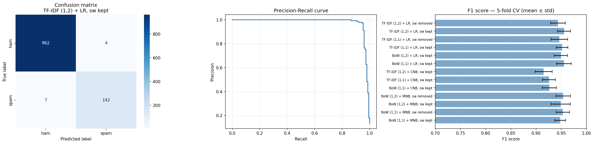

# SMS Spam Classifier

SMS spam detection using classical NLP and machine learning, built on the [SMS Spam Collection dataset](https://www.kaggle.com/datasets/uciml/sms-spam-collection-dataset).

The project was driven by experimentation — systematically varying text representations (BoW, TF-IDF), n-gram ranges, stopword handling, and model choice to understand how each decision affects classifier behaviour.

---

## Dataset

| Class | Count |
|-------|-------|
| Ham   | 4825  |
| Spam  | 747   |

Imbalanced at ~87% ham / 13% spam. Majority class baseline (always predicting ham) gives **0.866 accuracy** — the floor all models are measured against. All evaluation uses precision, recall, and F1 over 5-fold stratified cross-validation.

---

## Pipeline

```
raw SMS
   │
   ├─ clean_text()      lowercase · semantic token replacement · strip punctuation
   ├─ word_tokenize()   NLTK tokenization
   ├─ lemmatize()       WordNetLemmatizer
   ├─ vectorize         CountVectorizer  or  TfidfVectorizer
   └─ classify          MultinomialNB  /  ComplementNB  /  LogisticRegression
```

### Semantic token replacement

Instead of deleting patterns, surface features are replaced with tokens before stripping punctuation:

```python
re.sub(r'http\S+|www\S+',  ' __url__ ',      text)
re.sub(r'£|\$|€',          ' __currency__ ', text)
re.sub(r'\b\d{10,}\b',     ' __phone__ ',    text)
re.sub(r'!{2,}',           ' __exclaim__ ',  text)
```

This was validated by feature inspection post-training — `__phone__` (coef 7.62) and `__currency__` (coef 6.23) became the two strongest spam predictors. Early versions that blanket-removed digits and punctuation deleted these signals entirely.

Stopword removal is applied at the **vectorizer level** via `stop_words='english'`, not in preprocessing. This keeps bigram windows intact before filtering, enabling a clean controlled comparison.

---

## What Was Explored

| Dimension | Options tested |
|-----------|---------------|
| Vectorizer | Bag of Words (CountVectorizer), TF-IDF (TfidfVectorizer) |
| N-gram range | (1,1) unigrams · (1,2) unigrams + bigrams |
| Stopwords | kept · removed via vectorizer |
| Model | MultinomialNB · ComplementNB · Logistic Regression |

---

## Results

| Config | Precision | Recall | F1 |
|--------|-----------|--------|----|
| BoW (1,1) + MNB, sw kept     | 0.958±0.009 | 0.938±0.014 | 0.948±0.011 |
| BoW (1,1) + MNB, sw removed  | 0.953±0.016 | 0.953±0.018 | 0.953±0.013 |
| BoW (1,2) + MNB, sw kept     | 0.976±0.012 | 0.924±0.027 | 0.949±0.019 |
| BoW (1,2) + MNB, sw removed  | 0.964±0.012 | 0.944±0.020 | 0.954±0.014 |
| BoW (1,1) + CNB, sw kept     | 0.903±0.018 | 0.952±0.017 | 0.926±0.014 |
| TF-IDF (1,1) + CNB, sw kept  | 0.932±0.010 | 0.920±0.023 | 0.926±0.013 |
| TF-IDF (1,2) + CNB, sw kept  | 0.970±0.013 | 0.866±0.026 | 0.915±0.017 |
| BoW (1,1) + LR, sw kept      | 0.982±0.016 | 0.930±0.015 | 0.955±0.015 |
| BoW (1,2) + LR, sw kept      | 0.987±0.012 | 0.914±0.014 | 0.949±0.013 |
| TF-IDF (1,1) + LR, sw kept   | 0.953±0.015 | 0.950±0.013 | 0.952±0.011 |
| TF-IDF (1,1) + LR, sw removed| 0.950±0.016 | 0.942±0.018 | 0.946±0.017 |
| **TF-IDF (1,2) + LR, sw kept**| **0.960±0.018** | **0.952±0.011** | **0.956±0.013** |
| TF-IDF (1,2) + LR, sw removed| 0.937±0.014 | 0.950±0.017 | 0.943±0.015 |



**Best: TF-IDF (1,2) + Logistic Regression, stopwords kept — F1 0.956**

```
              precision    recall  f1-score   support

         ham       0.99      1.00      0.99       966
        spam       0.97      0.95      0.96       149
    accuracy                           0.99      1115
```

---

## Key Findings

**BoW vs TF-IDF**
BoW produced higher precision with Naive Bayes — aggressive count weighting strongly flags spam-heavy vocabulary. TF-IDF paired better with Logistic Regression, producing more balanced precision-recall profiles and lower variance across folds. The combination of representation and model matters more than either choice in isolation.

**MultinomialNB vs ComplementNB**
ComplementNB produced higher recall but lower precision than MultinomialNB across all configurations. It over-corrected for class imbalance, flagging too many legitimate messages as spam. For a spam filter where false positives are costly — a real email lost in the spam folder — MultinomialNB's conservative profile is more appropriate.

**N-gram range**
Unigrams were stable across all combinations. Adding bigrams improved F1 for LR + TF-IDF by capturing phrase-level spam patterns (`call __phone__`, `reply stop`, `free txt`). For Naive Bayes, bigrams increased precision but hurt recall due to greater sparsity on short SMS messages.

**Stopword removal**
Removing stopwords had negligible effect on unigrams — TF-IDF's IDF weighting already suppresses high-frequency tokens mathematically. For bigrams, keeping stopwords outperformed removing them since bigrams spanning function words (`reply to`, `call for`) carried contextual signal that removal destroyed.

---

## Top Learned Features

Logistic Regression coefficients — TF-IDF (1,2):

| Feature | Coef | |
|---------|------|-|
| `__phone__` | 7.62 | spam |
| `__currency__` | 6.23 | spam |
| `__url__` | 4.40 | spam |
| `free` | 4.39 | spam |
| `call __phone__` | 3.96 | spam (bigram) |
| `stop` | 3.28 | spam — "reply STOP to unsubscribe" learned as spam signal |
| `my` | -2.45 | ham |
| `me` | -2.23 | ham |
| `ok` | -1.76 | ham |

`stop` appearing as a spam indicator is a genuine failure mode — the regulatory opt-out phrase triggers the model on legitimate messages.

---

## Error Analysis

**False positives — ham flagged as spam:**
```
hey pple __currency__ 700 or __currency__ 900 for 5 night — excellent location wif breakfast
hi, selling intro to algorithms second edition for __currency__ 50
```
Currency tokens in legitimate sale or travel messages look identical to spam surface patterns. The model has no way to distinguish context.

**False negatives — spam reaching inbox:**
```
ringtoneking 84484
for sale arsenal dartboard good condition but no double or treble
```
Sparse spam with no phone number, URL, or currency — the strongest learned features simply do not fire.

---

## Stack

Python · pandas · numpy · NLTK · scikit-learn · matplotlib · seaborn

---

## Planned Extensions

- Linear SVM
- Threshold tuning via precision-recall curve
- Character-level n-grams — robust to obfuscation (`fr3e`, `F.R.E.E`)
- GridSearchCV for systematic hyperparameter search
- DistilBERT fine-tuning as a transformer-based comparison
